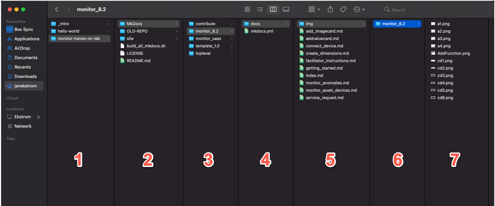

# Getting Started with contributing!

The first things you need to understand is the way this site is build and how the architecture looks like. This is needed so that your changes and additions does not break the consistancy and structure of the complete IBM Maximo Labs site.

## Structure of the labs

Here is the structure of the IBM Maximo Labs:

1. Location of the git repositories
2. The root folder of the monitor-hands-on-lab git repository. Basically only contain the build script and the MkDocs folder with all the MkDocs content folders.
3. A separate folder for each lab in the form <product>_<version> e.g. monitor_8.2. The toplevel, template_1.0 and contribute are all part of the main content and structure for the complete site, beside each individual lab folder.
4. Only contain the mkdocs.yml file to configure the MkDocs build of this site / sub-site. The content is stored in the docs folder.
5. Location of the markdown files that is the source files for the specific sub-site. The index.md is the landing page for the lab.
6. The img folder only contain one folder with the same name as the site / sub-site selected in level 3. This is needed when the complete site is build.
7. Location of the images for that site / sub-site. They should be referenced as img/<image>.png within the markdown files.

## Building the labs overview

Once you have the development environment in place and have cloned or forked the github repository, you are ready to look at the /build_all_mkdocs.sh file which is the shell script that is being used to build all the MkDocs that this site is being build of.  
Basically the /build_all_mkdocs.sh is divided into some different sections that each build the various MkDocs sites and subsites that the complete site comprises of. 
These are the building blocks of the build script:

*  Setting up some variables and erase the old site completely to avoid any leftovers
*  Building the toplevel content
*  Building the various labs with each there own separate MkDocs structure and navigation menu
*  Building the template and this contribute subsite
*  Finish up and start a webserver, so that you can look and navigate in the complete site 

Now you are ready to setup your development environment :-)
 